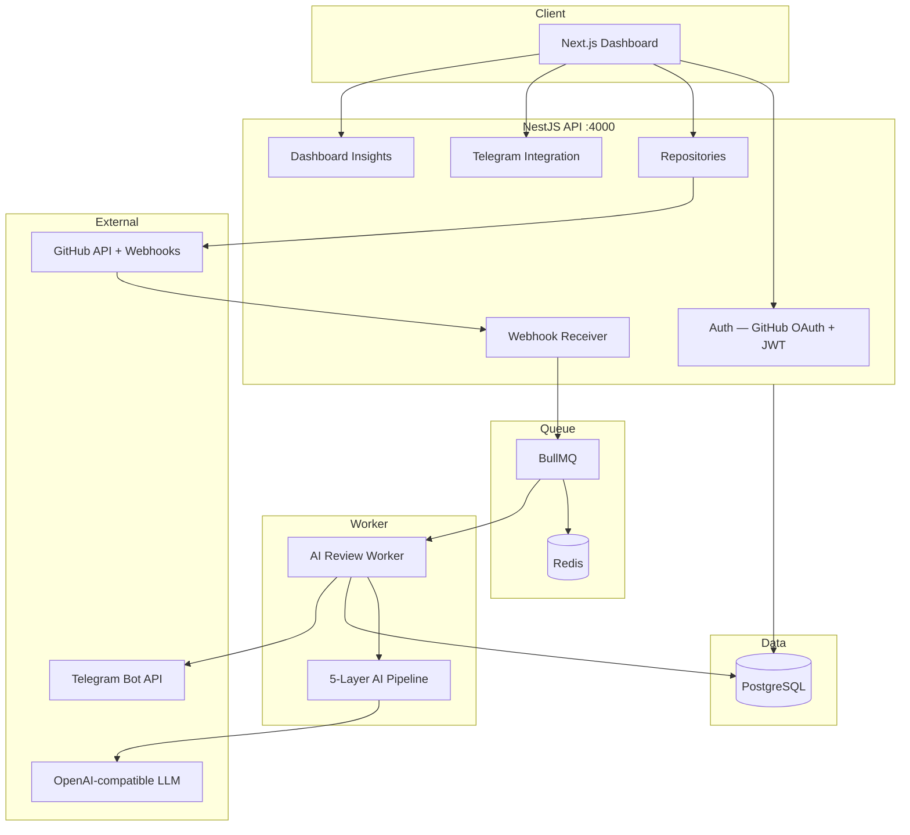
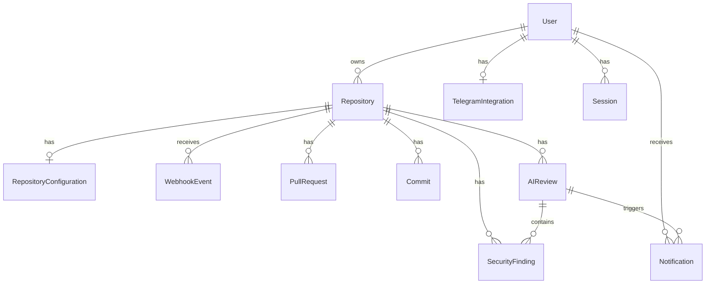

# GitGuardian AI — System Architecture

## 1. System Architecture



**Event flow:** GitHub Webhook → API enqueues → Worker fetches diff → AI Pipeline → DB → In-app + Telegram notifications.

---

## 2. Database ERD



See `packages/db/prisma/schema.prisma` for full schema.

---

## 3. Folder Structure

```
archetypes/C-gitguardian-ai/
├── apps/
│   ├── api/          # NestJS REST API
│   ├── web/          # Next.js 15 dashboard
│   └── worker/       # BullMQ consumer
├── packages/
│   ├── db/           # Prisma + PostgreSQL
│   ├── shared/       # Crypto utilities
│   └── ai-pipeline/  # 5-layer review engine
├── docs/             # Architecture & deployment
├── docker-compose.yml
└── package.json
```

---

## 4. Backend API Design

| Method | Endpoint | Description |
|--------|----------|-------------|
| GET | `/api/auth/github` | Start OAuth |
| GET | `/api/auth/github/callback` | OAuth callback |
| POST | `/api/auth/refresh` | Refresh JWT |
| POST | `/api/auth/logout` | Logout |
| GET | `/api/auth/me` | Current user |
| GET | `/api/repositories` | List repos |
| POST | `/api/repositories/sync` | Sync from GitHub |
| POST | `/api/repositories/:id/connect` | Enable agent + webhook |
| POST | `/api/repositories/:id/disconnect` | Disable agent |
| POST | `/api/webhooks/github/:repositoryId` | GitHub events |
| GET | `/api/dashboard/insights` | Dashboard widgets |
| POST | `/api/integrations/telegram/connect` | Save bot token |
| POST | `/api/integrations/telegram/verify` | Save chat ID |
| POST | `/api/integrations/telegram/test-message` | Test delivery |
| PATCH | `/api/integrations/telegram/preferences` | Notification prefs |
| DELETE | `/api/integrations/telegram/disconnect` | Remove integration |

---

## 5. Webhook Listener Design

- Per-repository webhook URL: `{PUBLIC_API_URL}/api/webhooks/github/{repositoryId}`
- HMAC SHA-256 signature verification
- Events: `pull_request`, `push`, `create`, `delete`, `issues`
- Persist to `WebhookEvent` → enqueue BullMQ with 5 retries + exponential backoff
- Failed after retries → `DEAD_LETTER` status

---

## 6. AI Review Pipeline

| Layer | Strategy |
|-------|----------|
| L1 | Rule-based: secrets, eval, XSS patterns (no LLM) |
| L2 | Send only changed file patches (max 15 files, 3KB each) |
| L3 | `AnalysisCache` — skip unchanged file hashes |
| L4 | `ReviewEmbedding` table for historical context (extensible) |
| L5 | Batch window via `batchWindowMinutes` in repo config |

Output: change summary, security score 0-100, impact, code quality, contributors, recommendations (mustFix / recommended / optional).

---

## 7. Cost Optimization Strategy

- Rules catch critical issues before LLM call
- Diff-only payloads (~1200 max tokens)
- File-level cache prevents re-analysis
- Embeddings retrieve relevant past reviews only
- Event batching configurable per repository

---

## 8. UI/UX Specification

- **Design:** Linear / Vercel inspired dark dashboard
- **Colors:** Primary `#6366F1`, Background `#0F172A`, Card `#1E293B`
- **Pages:** Landing, Login, Dashboard, Repositories, Telegram Settings
- **Components:** Sidebar, stat cards, repository cards, charts (Recharts), Framer Motion transitions
- **Error states:** GitHub reconnect, webhook retry, AI unavailable

---

## 9. Component Breakdown

| Component | Location |
|-----------|----------|
| Sidebar | `apps/web/components/Sidebar.tsx` |
| Dashboard insights | `apps/web/app/dashboard/page.tsx` |
| Repository cards | `apps/web/app/dashboard/repositories/page.tsx` |
| Telegram settings | `apps/web/app/settings/integrations/telegram/page.tsx` |

---

## 10. Security Best Practices

- GitHub tokens encrypted at rest (`ENCRYPTION_KEY`)
- Telegram bot tokens encrypted, masked in UI
- JWT access (15m) + refresh (7d) in httpOnly cookies
- Webhook HMAC verification per repository
- No secrets in LLM prompts (redaction in rules layer)
- Audit logs for user actions

---

## 11. Production Deployment Guide

```bash
# 1. Infrastructure
docker compose -f archetypes/C-gitguardian-ai/docker-compose.yml up -d

# 2. Database
cd archetypes/C-gitguardian-ai && npm run db:push

# 3. Environment — see .env.example (GitGuardian section)

# 4. Run
npm run dev:c   # from repo root
```

Deploy API/Worker/Web as separate containers behind HTTPS load balancer. Kubernetes-ready with horizontal worker scaling.

---

## 12. Implementation Plan

1. ✅ Prisma schema + Docker Compose
2. ✅ NestJS API (auth, repos, webhooks, telegram)
3. ✅ BullMQ worker + AI pipeline
4. ✅ Next.js dashboard + Telegram settings
5. 🔲 GitHub OAuth app registration (production)
6. 🔲 Email/Slack/Discord channels
7. 🔲 pgvector embeddings (Layer 4 full)
8. 🔲 E2E tests + load testing

---

## 13–15. Examples

### Example AI Review Output

```json
{
  "changeSummary": "User authentication flow modified in auth.service.ts",
  "securityScore": 42,
  "securitySeverity": "CRITICAL",
  "impactAnalysis": {
    "affected": ["Backend", "API"],
    "potentialImpact": ["Breaking Changes", "Security Risks"]
  },
  "recommendations": {
    "mustFix": ["Rotate exposed API key", "Remove eval usage"],
    "recommended": ["Add input validation tests"],
    "optional": ["Extract secrets to vault"]
  }
}
```

### Example Telegram Message

```
🚨 *CRITICAL Security Alert*

Repository: `backend-api`
Event: PR #42 opened

*Summary:*
Hardcoded API key detected in payment.service.ts

Severity: *CRITICAL*
Security Score: `42/100`

*Must Fix:*
• Move API key to environment variables

[View full review](https://app.example.com/reviews/abc123)
```

### Example Webhook Response

```json
{ "accepted": true, "eventId": "clx..." }
```
